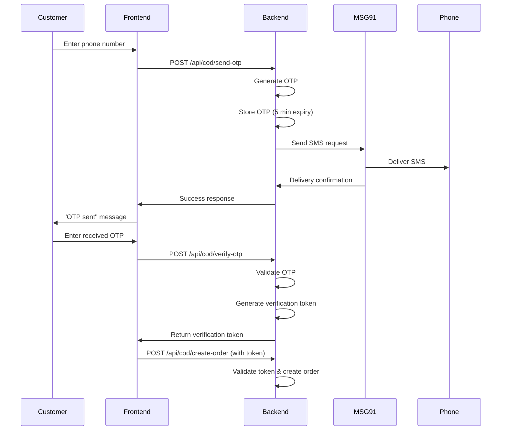

# MSG91 SMS Integration Guide

## 📱 **Complete MSG91 Setup for COD OTP System**

This guide covers the complete integration of MSG91 SMS service with your COD (Cash on Delivery) OTP verification system.

## 🎯 **Overview**

MSG91 is a leading SMS service provider in India offering:
- ✅ **High delivery rates** (95%+ in India)
- ✅ **Cost-effective pricing** (₹0.15-0.25 per SMS)
- ✅ **DLT compliance** for Indian telecom regulations
- ✅ **Real-time delivery tracking**
- ✅ **Professional sender IDs**

## 🔧 **Step 1: MSG91 Account Setup**

### **1.1 Create MSG91 Account**
1. Visit [MSG91 Dashboard](https://control.msg91.com/signup/)
2. Sign up with your business email
3. Verify your email and phone number
4. Complete KYC verification (required for production)

### **1.2 Get API Credentials**
1. **Login** to MSG91 dashboard
2. **Navigate** to `API` → `API Keys`
3. **Copy your Auth Key** (starts with "A" followed by numbers)

### **1.3 Register Sender ID**
1. **Go to** `Sender ID` section
2. **Click** "Add New Sender ID"
3. **Enter** your sender ID (e.g., "OTAKU1", "TSHIRT", "ATTARS")
   - Must be 6 characters (alphanumeric)
   - Should represent your brand
4. **Submit documents** for approval (takes 1-2 business days)

### **1.4 Create SMS Template (DLT Compliance)**
1. **Navigate** to `Templates` section
2. **Click** "Add Template"
3. **Template Type**: OTP
4. **Template Content**: 
   ```
   Your verification code for {#var#} is {#var#}. Valid for 5 minutes. Do not share this OTP with anyone.
   ```
5. **Submit for approval** (takes 1-2 business days)

## ⚙️ **Step 2: Environment Configuration**

### **2.1 Update Server Environment Variables**

Add these variables to your `server/.env` file:

```bash
# MSG91 SMS Service Configuration
MSG91_AUTH_KEY=your_actual_auth_key_here
MSG91_SENDER_ID=OTAKU1
MSG91_TEMPLATE_ID=your_approved_template_id
MSG91_ROUTE=4
```

### **2.2 Variable Explanations**

| Variable | Description | Example | Required |
|----------|-------------|---------|----------|
| `MSG91_AUTH_KEY` | API authentication key from MSG91 dashboard | `A1b2c3d4e5f6...` | ✅ Yes |
| `MSG91_SENDER_ID` | Your approved 6-character sender ID | `OTAKU1` | ✅ Yes |
| `MSG91_TEMPLATE_ID` | Your approved template ID for OTP messages | `1234567890` | ⚠️ Production |
| `MSG91_ROUTE` | Message route (4=transactional, 1=promotional) | `4` | No (default: 4) |

### **2.3 Production vs Development**

#### **Development Mode**
- Uses placeholder credentials
- OTP logged to console
- OTP returned in API response for testing
- No actual SMS sent

#### **Production Mode**
- Requires valid MSG91 credentials
- Actual SMS sent to customers
- OTP not returned in response
- Delivery tracking enabled

## 📡 **Step 3: API Integration Details**

### **3.1 SMS Service Architecture**

```javascript
// server/services/smsService.js
class SMSService {
  async sendOTP(phone, otp) {
    // Validates phone number format
    // Sends SMS via MSG91 API
    // Returns delivery status
  }
  
  async checkDeliveryStatus(requestId) {
    // Checks SMS delivery status
    // Returns delivery confirmation
  }
}
```

### **3.2 COD OTP Flow**



### **3.3 Rate Limiting & Security**

```javascript
// Automatic rate limiting: 3 SMS per hour per phone number
const rateLimit = checkSMSRateLimit(phone);
if (!rateLimit.allowed) {
  return res.status(429).json({
    error: `Too many OTP requests. Try again in ${rateLimit.resetIn} minutes.`
  });
}
```

## 🧪 **Step 4: Testing Instructions**

### **4.1 Development Testing**

1. **Start your server** with development environment
2. **Make OTP request**:
   ```bash
   curl -X POST http://localhost:8000/api/cod/send-otp \
     -H "Content-Type: application/json" \
     -d '{"phone": "+919876543210"}'
   ```

3. **Check response**:
   ```json
   {
     "success": true,
     "message": "OTP sent to your mobile number",
     "developmentOtp": "123456",
     "smsDebug": {
       "delivered": true,
       "requestId": "dev_1641234567890"
     }
   }
   ```

4. **Verify OTP**:
   ```bash
   curl -X POST http://localhost:8000/api/cod/verify-otp \
     -H "Content-Type: application/json" \
     -d '{"phone": "+919876543210", "otp": "123456"}'
   ```

### **4.2 Production Testing**

1. **Add real MSG91 credentials** to production environment
2. **Test with your own phone number** first
3. **Verify SMS delivery** and timing
4. **Check delivery reports** in MSG91 dashboard
5. **Monitor SMS balance** consumption

## 📊 **Step 5: Monitoring & Analytics**

### **5.1 SMS Delivery Monitoring**

```javascript
// Check delivery status
const status = await smsService.checkDeliveryStatus(requestId);
console.log('SMS Status:', status);
```

### **5.2 Account Balance Monitoring**

```javascript
// Check MSG91 account balance
const balance = await smsService.getBalance();
console.log('SMS Balance:', balance);
```

### **5.3 Key Metrics to Track**

- **Delivery Rate**: Percentage of SMS successfully delivered
- **Response Rate**: Percentage of customers who verify OTP
- **Cost per Conversion**: SMS cost per successful order
- **Rate Limit Hits**: Number of blocked requests due to limits

## 💰 **Step 6: Cost Management**

### **6.1 Pricing Structure**

| Volume | Rate per SMS | Monthly Cost (3000 SMS) |
|--------|--------------|-------------------------|
| 0-1K | ₹0.25 | ₹750 |
| 1K-10K | ₹0.20 | ₹600 |
| 10K+ | ₹0.15 | ₹450 |

### **6.2 Cost Optimization**

1. **Rate Limiting**: Prevent abuse (max 3 SMS/hour/phone)
2. **Phone Validation**: Block invalid numbers before sending
3. **Smart Retry**: Don't resend on delivery failures
4. **Analytics**: Track conversion rates to optimize

## 🚀 **Step 7: Production Deployment**

### **7.1 Pre-Deployment Checklist**

- ✅ MSG91 account verified and activated
- ✅ Sender ID approved by telecom operators
- ✅ SMS template approved (DLT compliance)
- ✅ Production credentials added to environment
- ✅ Phone number validation implemented
- ✅ Rate limiting configured
- ✅ Error handling and fallbacks in place
- ✅ Monitoring and alerts set up

### **7.2 Environment Variables for Production**

```bash
# Production Environment (.env)
NODE_ENV=production
MSG91_AUTH_KEY=A1b2c3d4e5f6... # Your actual auth key
MSG91_SENDER_ID=OTAKU1 # Your approved sender ID
MSG91_TEMPLATE_ID=1234567890 # Your approved template ID
MSG91_ROUTE=4
```

### **7.3 Deployment Steps**

1. **Update environment variables** on your hosting platform
2. **Test with production credentials** using test phone numbers
3. **Monitor initial SMS deliveries** closely
4. **Set up alerts** for delivery failures
5. **Document emergency contacts** for MSG91 support

## 🔍 **Step 8: Troubleshooting**

### **8.1 Common Issues**

#### **SMS Not Delivered**
```javascript
// Check logs for error messages
❌ MSG91 SMS sending failed: Authentication failed
❌ MSG91 SMS sending failed: Invalid sender ID
❌ MSG91 SMS sending failed: Template not approved
```

**Solutions**:
- Verify AUTH_KEY is correct
- Ensure sender ID is approved
- Check template approval status
- Confirm account balance

#### **OTP Verification Failing**
```javascript
// Debug verification token issues
❌ Invalid verification token
❌ Phone verification expired
❌ Phone number mismatch
```

**Solutions**:
- Check token expiry (10 minutes)
- Ensure phone number consistency
- Verify token storage mechanism

#### **Rate Limiting Issues**
```javascript
// Monitor rate limit logs
⚠️ Too many OTP requests for +919876543210
```

**Solutions**:
- Adjust rate limits if needed
- Implement user feedback
- Add manual override for testing

### **8.2 Support Contacts**

- **MSG91 Support**: [help@msg91.com](mailto:help@msg91.com)
- **Technical Support**: Available via dashboard chat
- **Emergency Contact**: Check dashboard for phone support

## 📈 **Step 9: Performance Optimization**

### **9.1 Redis Integration (Recommended)**

For production, migrate from in-memory storage to Redis:

```javascript
// Use Redis for OTP storage instead of Map()
const redisClient = require('../services/redisService');

// Store OTP in Redis with expiry
await redisClient.setex(`cod_otp_${phone}`, 300, JSON.stringify(otpData));

// Store verification tokens in Redis
await redisClient.setex(`verify_token_${token}`, 600, JSON.stringify(tokenData));
```

### **9.2 Bulk SMS Operations**

For high-volume applications:

```javascript
// Send multiple OTPs in batch
const bulkMessages = phones.map(phone => ({
  message: `Your OTP: ${generateOTP()}`,
  to: [phone]
}));

await smsService.sendBulkSMS(bulkMessages);
```

## 🏁 **Summary**

Your MSG91 integration provides:

- ✅ **Secure OTP delivery** to Indian mobile numbers
- ✅ **Professional SMS experience** with branded sender ID
- ✅ **High delivery rates** (95%+)
- ✅ **Cost-effective solution** (₹0.15-0.25 per SMS)
- ✅ **DLT compliant** for Indian telecom regulations
- ✅ **Real-time delivery tracking** and analytics
- ✅ **Scalable architecture** for high-volume applications

**Your COD system is now production-ready with professional SMS delivery!**

## 📞 **Next Steps**

1. **Set up MSG91 account** and get credentials
2. **Update environment variables** with real credentials
3. **Test with your phone number** to verify integration
4. **Monitor delivery rates** and optimize as needed
5. **Scale up** as your business grows

**Need help?** Check the troubleshooting section or contact MSG91 support.
